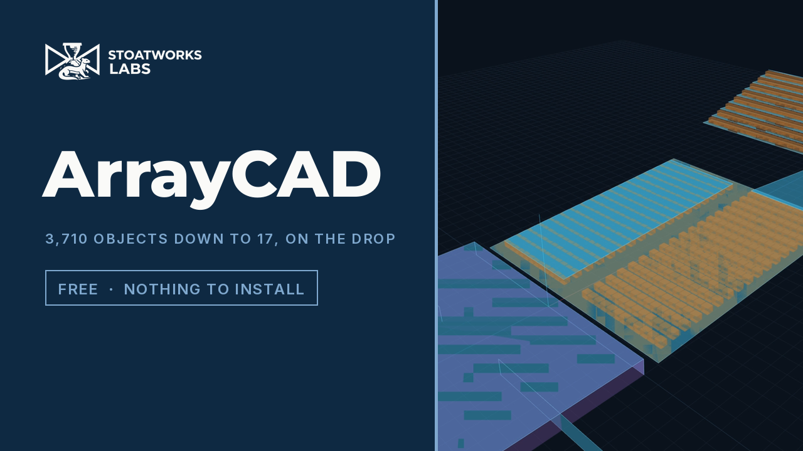
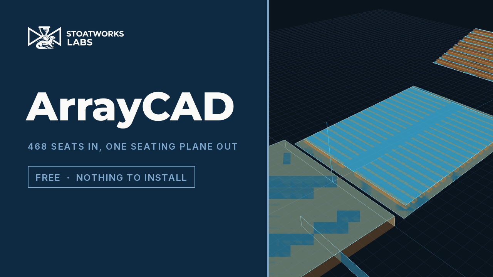
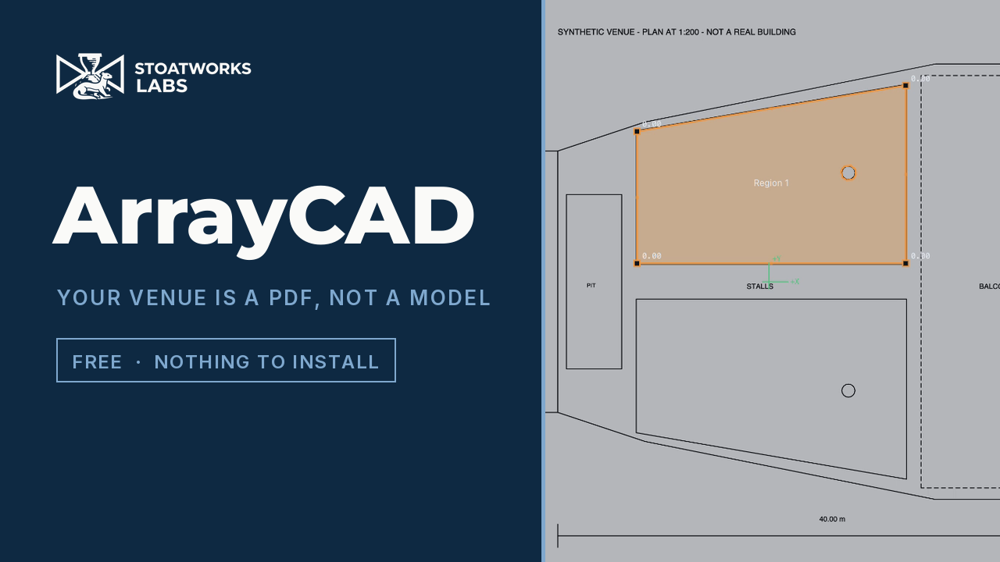

# ArrayCAD

**Turn a CAD venue model into a d&b ArrayCalc venue file.**

Drop in a DWG, DXF, glTF, IFC, OBJ or similar. ArrayCAD merges the model's triangles back
into flat planes, lets you throw away everything ArrayCalc does not need, lets you say
what each surface *is* — listening, surface, stage — and writes a `.dbacv`.

**L-Acoustics Soundvision too.** The same reduced venue exports as Soundvision *3D room
data* (`.txt`), the format its own SketchUp and Vectorworks plug-ins write. See
[Soundvision](#soundvision).

**And AFMG EASE Focus 3** (`.fc3`). EASE Focus has no geometry import at all — you type
coordinates or trace over a picture — so writing the project file is the only way in. See
[EASE Focus](#ease-focus).

**All three formats also open**, so ArrayCAD converts between the three prediction tools:
drop any one, write any other. See
[Converting between the prediction tools](#converting-between-the-prediction-tools).

**No 3D model? Trace one off the plan.** Drop a PDF or an image instead: set the scale,
click inside a room to detect its outline, and type a height at each corner. See
[Tracing a plan](#tracing-a-plan).

**Every seat modelled separately?** Select them or draw round them, and replace the lot with
the one seating plane they stand for. See
[Rationalising a seat-by-seat plan](#rationalising-a-seat-by-seat-plan).

**Most of that happens as the file opens.** Clutter left out, plane types read off the
names, banks of seats flattened, meshed surfaces re-cut — all of it visible, all of it one
click from being put back. See [Preparing a model on import](#preparing-a-model-on-import).

Browser only. No backend, no upload: the file never leaves your machine.

**[Try it →](https://arraycad.stoatworks-labs.com)**

### Watch

[](https://www.youtube.com/watch?v=HZ3ln72t0HA)

**[3,710 objects down to 17, on the drop →](https://www.youtube.com/watch?v=HZ3ln72t0HA)** —
what the layer names already tell it, read as the file opens. The box is unticked on camera,
because work that was saved is invisible and work being undone is not.

| | |
|---|---|
| [](https://www.youtube.com/watch?v=HFZKeIwCB5k) | [](https://www.youtube.com/watch?v=Ky7lkRAa8qE) |
| **[468 seats into one seating plane →](https://www.youtube.com/watch?v=HFZKeIwCB5k)** — doing it by hand, and why it is an assertion | **[Trace a venue off the plan →](https://www.youtube.com/watch?v=Ky7lkRAa8qE)** — no 3D model needed |

**[ArrayCalc *and* Soundvision →](https://www.youtube.com/watch?v=w2-KEFSz1Mk)** — one
reduction, two formats.

**[The original 50-second tour →](https://www.youtube.com/watch?v=g5TH-Y7cWNs)** — a CAD
model in, flat planes out.

---

## Why it is not just a file conversion

An ArrayCalc venue is a few dozen **parametric planes**. A CAD export of the same theatre
is tens of thousands of **triangles**. Handing ArrayCalc the triangles produces a file it
cannot usefully work with.

So the interesting part is the reduction:

```
import  →  weld  →  coplanar regions  →  outline  →  simplify  →  quads/triangles  →  .dbacv
```

The whole of a raked seating deck is one plane, however many triangles the CAD model spent
on it. A 12-triangle box is six. That collapse is the tool.

There is one thing that reduction cannot do, because it merges surfaces that **touch**. If
the plan models every seat individually — which architects' models routinely do — then four
hundred seats really are four hundred separate surfaces, and no tolerance setting will merge
them, because the gap between two seats is not a crack to be closed. The demo file for this
imports as **3,710 ArrayCalc objects**.

**Rationalise** is the answer to that: select the seats, or draw round them, and replace the
lot with the one plane they stand for. See [Rationalising a seat-by-seat
plan](#rationalising-a-seat-by-seat-plan). On import, ArrayCAD will offer to do it for you —
see [Preparing a model on import](#preparing-a-model-on-import).

## Supported inputs

| Format | Notes |
|---|---|
| **DXF** | Best for venue drawings. 3DFACE, polyface meshes, LWPOLYLINE (including bulges), SOLID, CIRCLE/ARC, ELLIPSE, SPLINE, INSERT blocks including row/column arrays. Reads `$INSUNITS`. Loose lines and arcs are **joined back into closed outlines**, which is what makes an ordinary 2D plan usable; closed outlines can then be extruded to a height. |
| **DWG** | AutoCAD's own format, read directly — no export step, no converter. R13 through R2018. Same entity support and the same outline-joining as DXF. |
| **glTF / GLB** | Best of the mesh formats — keeps object names and hierarchy, and declares metres and Y-up, so nothing has to be guessed. |
| **IFC** | The only format carrying real semantics. `IfcSlab`, `IfcCovering`, `IfcWall` etc. are mapped to *suggested* plane types. |
| **FBX, Collada, 3DS** | Keep names and hierarchy. |
| **OBJ, PLY, STL** | Geometry only. STL has no names at all, so the whole model arrives as one node. |
| **`.dbacv`** | An existing ArrayCalc venue, for pruning, retyping and converting to Soundvision. See the caveat below. |
| **Soundvision `.txt`** | An existing 3D room data export, for the same — and for converting to `.dbacv`. Surfaces are grouped by their label, which is your CAD layer name. |
| **EASE Focus `.fc3`** | An existing EASE Focus 3 project. Audience zones arrive as raked planes, one object per profile segment. `.fc2` must be re-saved as `.fc3` in EASE Focus first. |
| **PDF** | Not a model — a drawing. Opens the tracer. A vector PDF also gives its real drawn lines to snap to. |
| **PNG, JPEG, WebP, GIF, BMP** | A scan or a photo of a plan. Opens the tracer; outlines are recovered from the pixels. |

### Formats that need an export step first

`.vwx`, `.skp`, `.rvt`, `.3dm`, `.max`, `.blend` are **closed binary formats with no
public specification**. Nothing outside their own application can read them, and no amount
of work here changes that. Drop one in and ArrayCAD names the export to run instead — for
Vectorworks that is glTF first, then IFC, then DXF 3D.

DWG has no public specification either, but enough of it has been reverse-engineered that
it is read here directly. It is the one format on that list that no longer needs an export
step.

## Tracing a plan

Most venues that need a design have a **plan**, not a model. A PDF or an image opens a
tracer instead of the reducer, and the rest of the app is unchanged: a traced region
becomes exactly the same intermediate geometry a CAD import produces, so it goes through
the same conversion, the same inspector and the same writer.

Try it on **[`demo/demo-plan.pdf`](demo/demo-plan.pdf)** — a synthetic 1:200 venue with a
stage, a pit, two raked stalls blocks, columns and a balcony.

1. **Set the scale.** A drawing has no units. Either click each end of a dimension you
   know and type its real length, or — on a vector PDF — type the paper scale from the
   title block (`1:200`) and get an exact answer with no clicking. Measure across the
   *longest* dimension on the sheet: click accuracy is fixed, so spreading it over a
   longer line makes the error smaller.
2. **Set the origin** if you want it somewhere specific. Venue +X runs right across the
   sheet and +Y up it; **Heading** under Placement aims the room down +X afterwards.
3. **Get the outlines.** *Detect region* floods the enclosed area under the cursor and
   returns its outline — including any holes, so a column in the stalls comes out as a
   hole rather than being ignored. *Trace* draws one corner by corner, snapping to the
   drawing's own lines. Drag corners to adjust, alt-click one to delete it, click a
   midpoint to add one.
4. **Type the heights.** Every corner carries its own height in metres, so a level floor,
   a raked block, a raised balcony and a sunken pit (negative) are all the same operation.
   *Ramp* does the arithmetic: pick a front corner and a back corner, give each a height,
   and the rest follow the slope.

### Two ways to read the heights

| | |
|---|---|
| **Single plane** *(default)* | Fits one flat plane through the typed heights and puts every corner on it. Always **one** ArrayCalc object. A level floor and a constant rake are both exact; anything else is moved, and you are told by how much. |
| **Exactly as typed** | Uses the heights as they are. Right for a genuinely stepped or dished surface, but the result is not flat, so it comes out as several ArrayCalc objects. |

### What tracing cannot do for you

- **Accuracy is the scale you set.** A dimension misread by 5% makes the whole venue 5%
  wrong, and nothing downstream can tell. Check a second known dimension afterwards.
- **A raster plan is only as good as its render.** Pages are rasterised to 2400 px on the
  long edge, so on an A1 sheet one pixel is about 25 mm of building. Vector PDFs snap to
  the real lines and do not have this limit.
- **Region detect needs the area to be closed.** A doorway, a dashed balcony edge or a
  broken hairline lets the fill escape; it says so rather than silently returning the whole
  page. Raise *thicken lines* to bridge small gaps, or trace it by hand.
- **Seat rows seal a room.** On a plan with the seating drawn in, a flood fill stops at the
  first row. Trace the block outline instead — it is four clicks.

## Preparing a model on import

Most of the first ten minutes with a new file is work the drawing already describes. The
**Prepare** panel does it as the file opens, and every part of it is a decision you can see
and undo — nothing is deleted, and the objects it leaves out stay in the tree, ghosted in
the view, one click from coming back.

| | |
|---|---|
| **Leave out clutter** | Objects named as something other than a room surface: dimensions, text, lighting bars, truss, cable, ductwork, furniture, people — and modelled loudspeakers, since ArrayCalc and Soundvision place their own. Whole words only, so `TEXTURED PANEL` stays and `TEXT` goes. |
| **Leave out tiny objects** | Brackets, fixings, trim and stray facets, under a surface area you set. Seating is exempt: a seat pan is 0.2 m². |
| **Flatten seating into audience planes** | Banks of seats become the plane they stand for — the same thing the Rationalise panel does by hand, and editable there afterwards. Found by name, and by repetition: hundreds of alike, small, upward-facing objects a metre apart are a bank of chairs whatever they are called. Tiers separated in height become separate planes. |
| **Guess plane types from names** | `STAGE` becomes a stage, `WALL` and `CEILING` become surfaces. |
| **Re-cut heavy objects** | A meshed flat wall is hundreds of triangles describing one rectangle. Re-cutting it from its own outline gives the same shape with a fraction of the triangles — a faster viewport and a faster conversion. Anything not genuinely flat, or with a hole in it, is left alone. |

The panel then reports what it actually did to *your* model, with counts. On
`demo/demo-venue.dxf` that is 3,206 triangles down to 1,322, the lighting bars left out and
the balcony seating flattened: **116 ArrayCalc objects become 52** before you have touched
anything. On `demo/demo-seats.dxf`, the seat-by-seat plan, it is **3,710 objects down to
17**.

Untick a box and it re-runs from the file as imported. It reads the model once, when it
opens, using the units in force then — so if the unit guess was wrong, fix it and re-run.

## Rationalising a seat-by-seat plan

An architect's model draws every seat. A sound designer wants the seating *area*. The
**Rationalise** panel turns the first into the second.

Pick what to gather up, in whichever way suits the drawing:

- **Select in the tree** — right when each seat, or each block, is its own object, as in a
  glTF or IFC export.
- **Box select** — drag a rectangle in the 3D view over the objects you want.
- **Draw an area** — click the corners of the region in the view. This is the one that
  matters for a DXF or DWG, where the whole house is usually on **one layer** and no amount
  of pruning in the tree separates the stalls from the balcony.

Then it fits a single plane through what it captured and gives you its outline.

Two settings decide most of the result:

- **Capture** — *Upward faces* (the default) keeps only surfaces pointing up, so a modelled
  seat reduces to its pan rather than dragging the plane down inside the seat. *All faces*
  is for a wall or a bare rake.
- **Outline** — *Follow* traces the seating and bridges gaps up to a distance you set. Set
  it to the row pitch: it joins seat to seat and row to row, and leaves an aisle wider than
  the pitch standing as an aisle. *Hull* is the convex hull, fine for a rectangular block
  and wrong for a horseshoe. *Rectangle* squares it off, which a Positioning area must be.

**Combine the tree and the drawing.** If you select the seating layer first and then draw,
only the seating inside your outline is captured. Draw with nothing selected and it takes
everything under the polygon — including the floor beneath the seats, which fits the plane
half a seat height too low. The panel says which it is about to do.

### Read the numbers underneath

Every area reports what the reduction cost, because "these four hundred seats are one
surface" is your assertion and not the geometry's:

```
432 of 5,184 triangles
46.7 m² of surface → 129.4 m² 
up to 0.02 m off plane
```

The first line is how much survived the capture filter. The second is real seat surface
against the area it now stands for — much larger, and rightly so, since the air between the
seats is the point; wildly larger usually means two blocks got caught in one go. **The third
is the one to look at.** A smooth rake reads a centimetre or two. A rake modelled as steps
reads half a tread, which is expected. Metres means you have captured two tiers and should
rationalise them separately — and it says so.

Separate areas are kept separate. Two blocks either side of a gangway come back as two
planes with a note saying nothing bridged them, rather than one plane paved across the
traffic route.

**Replace the originals** is on for a tree selection and off for a drawn area, since a
drawn area usually covers only part of a layer. Turn it off to see the new plane and the
seats it came from together before committing.

Nothing here edits the model. A rationalisation is a decision, recomputed from the source
geometry every time — change the units afterwards and it moves with the room; delete it and
the seats come back.

Try it on `demo/demo-seats.dxf` (regenerate with `python3 scripts/make_demo_seats.py`):
3,710 objects without it, 16 once both seating blocks are rationalised — or 17 the moment
you drop the file, since [Prepare](#preparing-a-model-on-import) recognises both blocks by
name and does it for you.

## Vectorworks plug-in

For Vectorworks there is a second route that skips the intermediate file entirely:
**[`vectorworks/`](vectorworks/README.md)** is a Python plug-in that runs inside
Vectorworks and writes `.dbacv` directly.

It can do better than the browser tool, because inside Vectorworks it can see your
**class names** — which an export throws away — and use them to decide what each object
is. It also knows venue-specific tricks the browser tool cannot: take just the top face of
a seating solid, or collapse a lighting bridge to a single ArrayCalc box instead of six
quads.

⚠️ **It has never been run inside Vectorworks.** Everything testable without Vectorworks
is tested (80 tests, including the same byte-exact format check), but the one module that
calls the Vectorworks API is unverified. Run its probe script first. See
[vectorworks/README.md](vectorworks/README.md).

## Getting a good result

1. **Export less.** In the CAD tool, export only the classes you need — seating, stage,
   walls, ceiling — and leave lighting, rigging, trussing and dimensions behind. This
   saves more work than anything in this app.
2. **Check the units.** Only glTF and IFC state them, and DXF often says "unitless". The
   app guesses from the model's overall size and tells you when it is guessing. Check it
   against a dimension you know.
3. **Set the datum.** ArrayCalc wants the audience towards **+X**, Y symmetric about zero,
   Z up. Use heading, offset and the mirror toggle; the drawn axes show which way is which.
   For the offset, **Pick in view** next to *Origin* is usually quicker than typing: click
   a point on the model — centre stage, the front edge of the stalls — and it becomes 0, 0,
   0, with the axes moving there. The marker turns blue and snaps when the cursor is near a
   corner, so a corner lands exactly rather than a millimetre off it, and picking works on
   the converted planes as well as on the source. Esc cancels. Set the **heading** before
   the origin: the room turns about the model's own datum, which carries the picked point
   off zero.
4. **Choose a fit.** *Rectangle* collapses each region to one rectangle, aligned to the
   level direction of its own plane so it is always writable as a single ArrayCalc quad —
   one object per region, and usually what you want for seating. *Follow outline* is
   faithful, but a ragged CAD outline turns into many objects, and any face that is not a
   symmetric trapezoid has to be split into two triangles.
5. **Watch the object count.** If it is in the hundreds, raise the merge tolerances, raise
   the minimum area, or switch to rectangle fit.

### Pruning a long object list

A venue is pruned by throwing away whole categories, not objects one at a time, so the
object tree groups itself:

- **Groups are named after what is in them.** A `.dbacv` names every group after its own
  GUID; ArrayCAD reads a real name back off the children instead, so a row says `TIER 3`
  rather than `RoomObjectGroup: {c9ab9376-…}`.
- **A flat list gets grouped by name.** A DXF, a DWG or a flat glTF export is one long list
  of siblings, and ArrayCAD clusters it by the structure already in the names — whether the
  category leads (`TIER 3 - LEFT 1`) or trails a number (`25 loge`, `45 loge`).
- **Every group folds away and selects in bulk.** The triangle beside a group hides its
  contents; its checkbox includes or excludes everything under it at once, and shows a dash
  when only some of it is in.
- **Group by** switches between the automatic name grouping, grouping by the **plane type**
  you have assigned — the quickest way to check nothing is mistyped before exporting — and
  the raw tree with no grouping at all.

## The `.dbacv` format

It is undocumented. Everything this tool knows was reverse-engineered from one real
ArrayCalc 12.8.2 export **plus three round trips through ArrayCalc itself**, and is written
up in **[docs/dbacv-format.md](docs/dbacv-format.md)**.

The reader and writer reproduce that file **byte for byte**, which is good evidence the
structure is right.

The round trips were worth doing. The first one FAILED and found a real bug: a `Shape=1`
quad must be written in ArrayCalc's own local frame — origin on the *near edge*, not the
centroid — and getting it wrong makes ArrayCalc **silently collapse the plane to zero
depth**, sometimes not until weeks later. By the third round every object came back
byte-identical, and that result is pinned as a test. They also settled that `PlaneType 5`
is a "Positioning area" which must be rectangular, and that a listener height is kept on
type 1 but silently reset on type 2.

> ⚠️ **Some plane-type names are still inferred.** `Positioning area` (5) comes from
> ArrayCalc's own dialog, and `Listening` (1) is near-certain. `Surface` (2) and `Stage`
> (4) are still deductions, and type 3 is a real type whose name is unknown. The app
> always shows the raw numeric code beside the label, because that is what actually gets
> written. Check a converted venue in ArrayCalc before trusting a whole design to it.

### Re-importing a `.dbacv` is lossy

Opening an existing venue tessellates every object into triangles and rebuilds it from
planes. Arc segments and boxes come back as flat quads. Use it to prune and retype, not to
preserve.

## Soundvision

**Export .txt**, then in Soundvision: *3D room data → Import 3D room data*.

Soundvision's native scene file (`.xmls`) is encrypted — AES-256-CBC with a key the
application assembles at runtime — so nothing outside Soundvision can write one. The export
target is instead the format L-Acoustics documents for exactly this job, and that its own
SU4SV (SketchUp) and Vectorworks plug-ins produce:

> It is possible to import in Soundvision 3D room data `*.txt` files that were exported from
> CAD software, such as SketchUp or Vectorworks.

It is a plain list of labelled, planar polygons, which suits the reduction better than
`.dbacv` does: a Soundvision surface is a **free polygon**, so a six-sided balcony stays one
surface instead of being split into two triangles to fit ArrayCalc's canonical quad.

Two things to know:

- **The format carries geometry and a label, nothing else.** Audience listening levels, and
  which surfaces are enabled for mapping, are set in Soundvision after importing — that is
  its normal workflow. Faces are labelled with your CAD layer names so you can find them.
- **Winding matters, and getting it wrong is silent.** Soundvision needs surface points
  counter-clockwise; a reversed one is not an error, it just returns no mapping result.
  ArrayCAD orients every face for you.

The grammar, the evidence behind it and what is still unverified are in
**[docs/soundvision-format.md](docs/soundvision-format.md)**.

### Confirmed inside Soundvision

An ArrayCAD-written file was imported into **Soundvision 3.18.0.15 (2026.2)** on 2026-08-02
and read back surface by surface. A 20 × 12 m floor, a rake rising 0 → 3 m, a **six-sided
polygon** and a vertical wall all arrived with the exact coordinates written, in order. The
hexagon came in as **one surface of six points**, which is the whole reason this target
suits the reduction better than `.dbacv`. Soundvision also strips the ` face` suffix from a
label itself, so names round-trip unchanged.

> ⚠️ **Geometry is confirmed; acoustic orientation is not.** A surface can land in exactly
> the right place and still return no mapping result if it is wound the wrong way — that is
> the trap described above, and it is silent. ArrayCAD orients every face, but no prediction
> has yet been run over an imported surface to prove it. Check a mapping before trusting a
> whole design to it.

## EASE Focus

**Export .fc3**, then open it in EASE Focus 3 — *File → Open*. There is no import step
because **EASE Focus has no geometry import**: its own guide offers typed coordinates
(including polar, for a laser-and-inclinometer survey) or a picture to trace over, and
nothing else. Opening the project file is the way in.

The catch is the model. EASE Focus has no surfaces at all — a venue is a set of
**audience zones**: a plan rectangle with a position, an orientation and a height profile
along its axis. So this export is a real reduction, not a re-serialisation:

- **Only Listening planes convert.** Walls, ceilings and stages have no equivalent in EASE
  Focus, so leaving them out is not lossy, it is the only honest thing to do.
- **Each plane becomes one oriented rectangle** with a single profile segment, front edge
  at the low side, audience facing downslope. Outline detail and holes are lost — the
  format has nowhere to put them.
- **Zones narrower than 2 m are silently widened to 2 m** by EASE Focus itself, centres
  unmoved, with nothing on screen to say so. Seat-by-seat rows are routinely narrower than
  that, so ArrayCAD warns per zone. [Rationalise](#rationalising-a-seat-by-seat-plan) the
  rows into blocks first and the problem goes away.

The container, the model and the evidence are in
**[docs/ease-focus-format.md](docs/ease-focus-format.md)**.

### Confirmed inside EASE Focus

Checked against **EASE Focus 3.1.260** on 2026-08-03. The 57 audience planes of a real
ArrayCalc theatre export were written as a project, opened, and saved back by the
application: 57 zones returned, all 57 labels intact, and every position, orientation,
depth and height identical to what was written. The only change the application made was
the 2 m width clamp above — which is how that behaviour was found.

## Converting between the prediction tools

None of the three applications will open another's venue, so a room modelled for one
normally gets redrawn by hand for the next — a day's work that also guarantees the
predictions are of subtly different buildings.

All three formats are inputs here, so the conversion is just an import and an export:

| You have | Drop it in | Press |
|---|---|---|
| A d&b ArrayCalc venue | `.dbacv` | **Export .txt** → *3D room data → Import 3D room data*, or **Export .fc3** |
| A Soundvision room | 3D room data `.txt` | **Export .dbacv** or **Export .fc3** |
| An EASE Focus project | `.fc3` | **Export .dbacv** or **Export .txt** |

Nothing special happens in between: the venue takes the same road a CAD model does —
tessellate, weld, merge coplanar regions, recover outlines, write the other format — so
you get the same tree, the same pruning and the same plane typing on the way through.

What that means in practice:

- **It is not a byte-preserving translation, and should not be.** The two formats do not
  describe the same things. ArrayCalc has boxes and arc segments and plane types;
  Soundvision has free polygons and a label. Going either way, geometry is rebuilt from
  planes — see [Re-importing a `.dbacv` is lossy](#re-importing-a-dbacv-is-lossy).
- **Soundvision → ArrayCalc loses nothing that was there**, because 3D room data carries no
  plane types or listening levels to lose. You set those here, once, on the way through.
- **ArrayCalc → Soundvision keeps more shape than the reverse**, because a Soundvision
  surface is a free polygon while an ArrayCalc quad must be a symmetric trapezoid.
- **Anything → EASE Focus keeps the least**, because EASE Focus keeps the least: audience
  zones only, each one a rectangle. Convert *out* of EASE Focus and you get exactly the
  audience back — its zones are unambiguous — but nothing that was never in it.
- **Surfaces come in grouped by their label.** L-Acoustics' own plug-ins write
  `"<layer name> face"`, so a room exported from Vectorworks arrives with the CAD layer
  tree intact and pruneable. The ` face` suffix is stripped on the way in and re-applied on
  the way out, so a name does not grow a word on every trip.

> ⚠️ The Soundvision caveat above applies to this route too: the geometry is confirmed to
> import, but no prediction has yet been run over an imported surface.

## Develop

```bash
npm install
npm run dev
```

```bash
npm test
```

```bash
npm run build
```

See [CLAUDE.md](CLAUDE.md) for the full command reference and [AGENTS.md](AGENTS.md) for
the model, the invariants and the traps.

## Licence

MIT.
