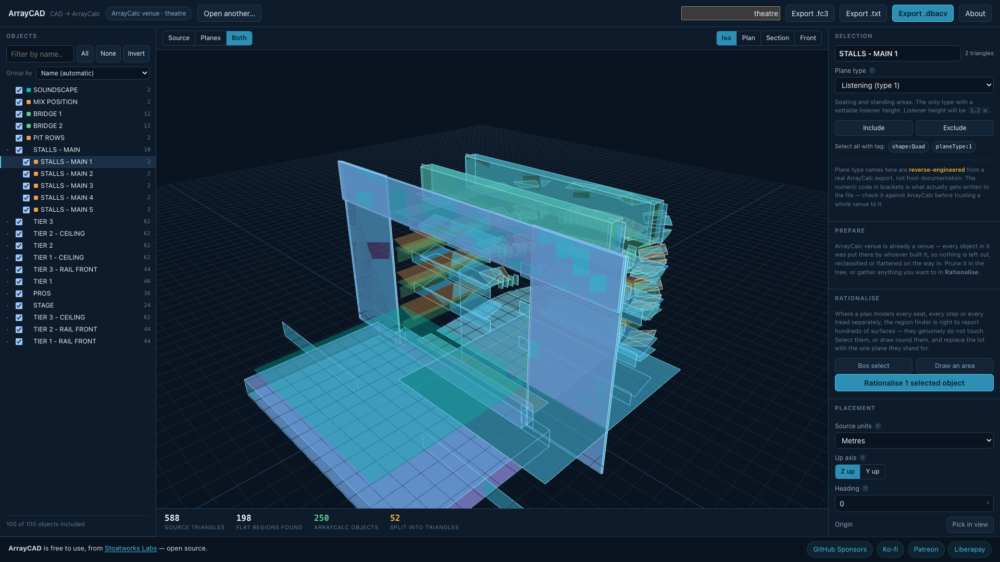

# ArrayCAD user guide

**Turn a CAD venue model into a d&b ArrayCalc venue file** — and into L-Acoustics Soundvision and
AFMG EASE Focus 3 projects, in any direction.

Drop in a DWG, DXF, glTF, IFC, OBJ or similar. ArrayCAD merges the model's triangles back into flat
planes, lets you throw away everything the prediction tool does not need, lets you say what each
surface *is* — listening, surface, stage — and writes the file.

Browser only. **No backend, no upload: the file never leaves your machine.**

> **Before you rely on this:** the geometry is verified against the applications themselves, not
> against a description of them. A written `.dbacv` reproduces a real ArrayCalc export **byte for
> byte** and has been round-tripped through ArrayCalc until every object came back untouched; a
> written Soundvision file was imported into Soundvision and read back surface by surface; and an
> EASE Focus project of 57 audience planes was opened and saved by EASE Focus with all 57 labels
> and every coordinate intact. 361 tests pin the reduction.
>
> **What none of that proves is acoustic orientation.** No prediction has yet been run over an
> imported surface, and **a surface wound the wrong way lands in exactly the right place and then
> silently returns no mapping result.** Check a mapping before trusting a whole design to it.
>
> This codebase was created with AI assistance, directed and reviewed by a human author.

---

## Three formats, and it converts between them

| | |
| --- | --- |
| **d&b ArrayCalc** | `.dbacv` |
| **L-Acoustics Soundvision** | *3D room data* `.txt` — the format its own SketchUp and Vectorworks plug-ins write |
| **AFMG EASE Focus 3** | `.fc3` |

**All three also open**, so ArrayCAD converts between the three prediction tools: drop any one,
write any other.

EASE Focus is the one that gains most: **it has no geometry import at all** — you type coordinates
or trace over a picture — so writing the project file is the only way in.

---

## Coming from a lighting visualiser

If the venue is already built in **Capture, Depence, WYSIWYG, grandMA3 or Vectorworks**, export
**MVR** from it and drop that in. MVR is the open interchange format all of them share; their own
project files are closed and cannot be read by anything else.

An MVR is a whole show, so most of it is rig. That is handled: truss, fixtures, supports and
projectors are recognised by their MVR type rather than their name, so **the rig prunes itself**
even when a truss is called `Sunstrip 12`. Video screens are deliberately kept — an LED wall is a
large hard reflector and belongs in the prediction. Lighting fixtures are left out entirely, for
the same reason loudspeakers always have been: the prediction places its own.

The format states millimetres and Z-up, so the units are not a guess. Check the size against the
drawing anyway — the spec is silent on the units of the 3D models inside the archive, and ArrayCAD
warns if the room comes out an implausible size.

---

## Preparing a model on import

**Most of the first ten minutes with a new file is work the drawing already describes.** The
**Prepare** panel does it as the file opens, and **every part of it is a decision you can see and
undo** — nothing is deleted, and the objects it leaves out stay in the tree, ghosted in the view,
one click from coming back.

| | |
|---|---|
| **Leave out clutter** | Objects named as something other than a room surface: dimensions, text, lighting bars, truss, cable, ductwork, furniture, people — and modelled loudspeakers, since the prediction tools place their own. **Whole words only**, so `TEXTURED PANEL` stays and `TEXT` goes. |
| **Leave out tiny objects** | Brackets, fixings, trim and stray facets, under an area you set. **Seating is exempt** — a seat pan is 0.2 m². |
| **Flatten seating into audience planes** | Found by name **and by repetition**: hundreds of alike, small, upward-facing objects a metre apart are a bank of chairs whatever they are called. Tiers separated in height become separate planes. |
| **Guess plane types from names** | `STAGE` becomes a stage; `WALL` and `CEILING` become surfaces. |
| **Re-cut heavy objects** | A meshed flat wall is hundreds of triangles describing one rectangle. Re-cutting from its own outline gives the same shape with a fraction of the triangles. **Anything not genuinely flat, or with a hole in it, is left alone.** |

The panel then reports what it actually did to **your** model, with counts. On the demo venue that
is 3,206 triangles down to 1,322 and **116 ArrayCalc objects down to 52** before you have touched
anything; on the seat-by-seat plan, **3,710 objects down to 17.**

**Untick a box and it re-runs from the file as imported.** It reads the model once, when it opens,
using the units in force then — **so if the unit guess was wrong, fix it and re-run.**

---

## Rationalising a seat-by-seat plan

An architect's model draws every seat. A sound designer wants the seating **area**.

Pick what to gather up, in whichever way suits the drawing:

- **Select in the tree** — right when each seat or block is its own object, as in a glTF or IFC
  export.
- **Box select** — drag a rectangle in the 3D view.
- **Draw an area** — click the corners of the region. **This is the one that matters for a DXF or
  DWG**, where the whole house is usually on *one layer* and no amount of pruning in the tree
  separates the stalls from the balcony.

Two settings decide most of the result:

- **Capture** — *Upward faces* (the default) keeps only surfaces pointing up, so a modelled seat
  reduces to its pan **rather than dragging the plane down inside the seat.** *All faces* is for a
  wall or a bare rake.
- **Outline** — *Follow* traces the seating and bridges gaps up to a distance you set. **Set it to
  the row pitch**: it joins seat to seat and row to row, and leaves an aisle wider than the pitch
  standing as an aisle. *Hull* is the convex hull — fine for a rectangular block, wrong for a
  horseshoe. *Rectangle* squares it off, which a Positioning area must be.

> **Combine the tree and the drawing.** Select the seating layer first and then draw, and only the
> seating inside your outline is captured. **Draw with nothing selected and it takes everything
> under the polygon — including the floor beneath the seats, which fits the plane half a seat
> height too low.** The panel says which it is about to do.

**Read the numbers underneath.** Every area reports what the reduction cost, because "these four
hundred seats are one surface" is *your* assertion and not the geometry's.

---

## No 3D model? Trace one off the plan

Drop a PDF or an image instead: set the scale, click inside a room to detect its outline, and type
a height at each corner.

---

## If something is wrong

| Symptom | Cause |
| --- | --- |
| **A mapping returns nothing, and the geometry looks right** | A surface is wound the wrong way. It lands in the right place and silently maps nothing — check a mapping early. |
| **Everything came in at the wrong scale** | The unit guess. Fix it and re-run the import; it reads the model once, with the units in force then. |
| **A seating plane sits half a seat too low** | The floor under the seats was captured. Select the seating layer before drawing. |
| **An aisle was swallowed** | The follow distance is wider than the aisle. Set it to the row pitch. |
| **A horseshoe came back as a block** | *Hull* outline. Use *Follow*. |
| **Something useful was left out** | Nothing is deleted — it is ghosted in the tree, one click from coming back. |
